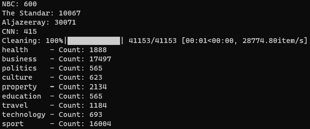
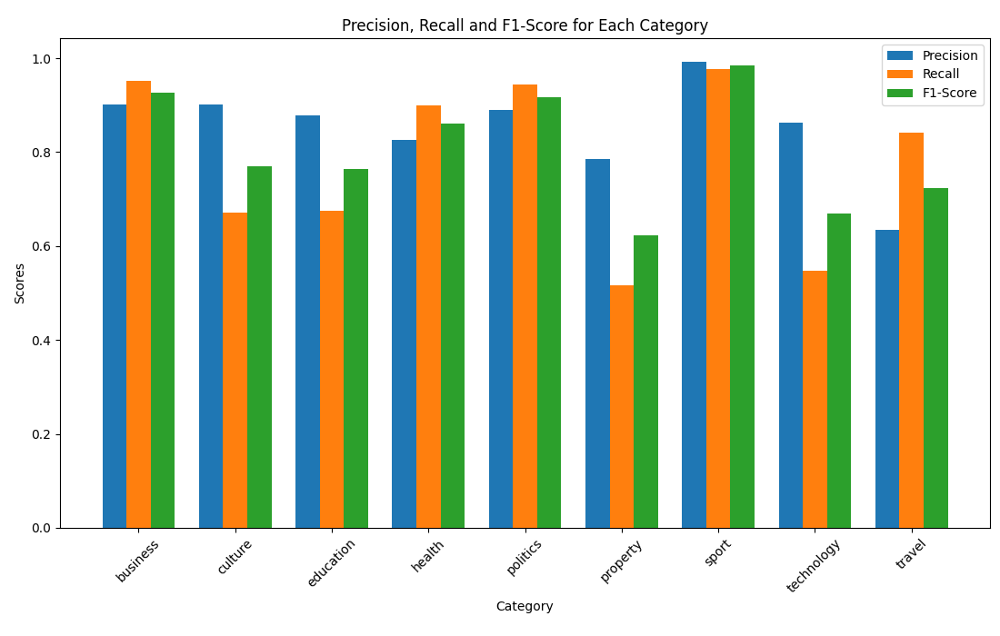
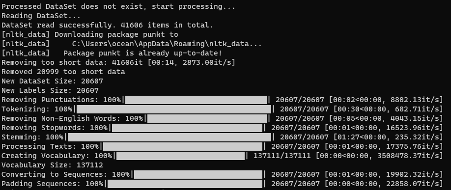
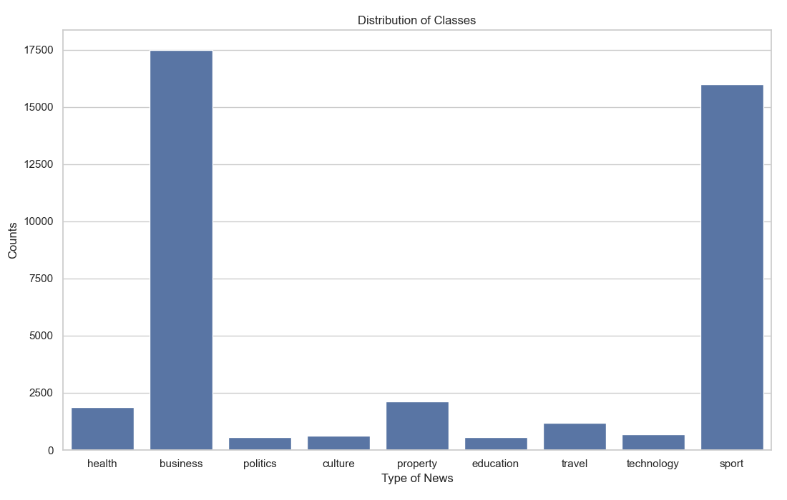

<a name="top"></a>
---

- [Data Collection Steps](#data-collection-steps)
  - [News Links Format](#news-links-format)
  - [News Data Format](#news-data-format)
  - [News Cawler Time](#news-cawler-time)
  - [Total News](#total-news)
- [Use Model](#use-model)
  - [Classificatino](#classificatino)
  - [Summerization](#summerization)
- [Classificatino in Naive Bayes (NB)](#classificatino-in-naive-bayes-nb)
  - [Parameter Tuning in NB](#parameter-tuning-in-nb)
  - [Tuning Detail in NB](#tuning-detail-in-nb)
    - [Performance Summary](#performance-summary)
    - [TfidfVectorizer Parameters Tuning](#tfidfvectorizer-parameters-tuning)
- [Classificatino in Gated Recurrent Unit (GRU)](#classificatino-in-gated-recurrent-unit-gru)
  - [Data Preprocessing](#data-preprocessing)
  - [Reasons for Using Class Weights](#reasons-for-using-class-weights)
  - [Tuning Setting](#tuning-setting)
  - [Step-by-Step Breakdown](#step-by-step-breakdown)
  - [Training Parameters](#training-parameters)
  - [Early Stopping](#early-stopping)

---

# Data Collection Steps
```mermaid
graph TD
cawler01[The Standard]
cawler02[Aljazeera News]
cawler03[NBC News]
cawler04[CCN News]
getLinks01[Get Links]
getLinks02[Get Links]
getLinks03[Get Links]
getLinks04[Get Links]
getData01[Get Data]
getData02[Get Data]
getData03[Get Data]
getData04[Get Data]
composeData[Compose Data]
dataSet[(Data Set)]

cawler01 --> getLinks01 --> getData01 --> composeData
cawler02 --> getLinks02 --> getData02 --> composeData
cawler03 --> getLinks03 --> getData03 --> composeData
cawler04 --> getLinks04 --> getData04 --> composeData
composeData -- Clean Data --> dataSet
```

#### News Links Format
```json
{
    "link": "https://www.cnn.com/politics/live-news/republican-debate-11-08-23/index.html",
    "title": "Third 2024 Republican presidential debate",
    "type": "politics"
}
```
#### News Data Format
```json
{
    "title": "Third 2024 Republican presidential debate",
    "content": "The third Republican presidential...",
    "category": "politics",
    "link": "https://www.cnn.com/politics/live-news/republican-debate-11-08-23/index.html"
}

```
## News Cawler Time
#### Aljazeera News

#### CCN News

#### The Standard

#### NBC News


## Total News
#### We clean data in this step


#### [Back to Top](#top)

# Use Model
### Classificatino
|Model|Done At|
|-|-|
|Naive Bayes (NB)|23-11-2023|
|Gated Recurrent Units (GRU)|27-11-2023|

### Summerization
|Model|Done At|
|-|-|
|Bidirectional Encoder Representations from Transformers (BERT)|23-11-2023|
|T5|25-11-2023|

#### [Back to Top](#top)

# Classificatino in Naive Bayes (NB)
```mermaid
graph TD
step01[Data Collection]
step02[Clean Data]
step03[Model Training]
step04[Model Evaluation]
if01{Good Model?}
step05[Parameter Tuning]
step06[Model Deployment]

step01 --> step02 --> step03 --> step04 --> if01
if01 -- No --> step05 --> step03
if01 -- Yes --> step06
```

## Parameter Tuning in NB
```mermaid
graph TD
step00[Start]
step01[Check Result]
if01{Good Result?}
step02[Start Tuning]
step03[Model Deployment]
subgraph Tuning
    step04[Check top 10 words in each category]
    step05[Add words to stop word list]
    step06[Set vectorize parameter]
end

step00 -- NB-ModelEvaluation.py --> step01 --> if01
if01 -- Yes --> step03
if01 -- NO --> step02
step02 -- NB-FeatureAnalysis.py --> step04
step04 --> step06 -- NB-ModelEvaluation.py --> step01
step04 --> step05 -- NB-ModelEvaluation.py --> step01
```

## Tuning Detail in NB
|Before Tuning|After Tuning|
|-|-|
|Vectorize|Vectorize|
|NB-ModelEvaluation.py|NB-ModelEvaluation.py|
|NB-FeatureAnalysis.py|NB-FeatureAnalysis.py|

#### Before Tuning


#### After Tuning


## Performance Summary
### Before Tuning
- **Precision, Recall, and F1-Score (Average across categories):**
  - Precision: 0.30
  - Recall: 0.23
  - F1-Score: 0.21
- **Accuracy:** 80%
- **Notable Observations:**
  - Very low precision, recall, and F1-score for several categories (culture, education, health, politics, property, technology, travel).
  - High accuracy in business and sport categories.
  
### After Tuning
- **Precision, Recall, and F1-Score (Average across categories):**
  - Precision: 0.85
  - Recall: 0.78
  - F1-Score: 0.80
- **Accuracy:** 92%
- **Notable Improvements:**
  - Significant improvement in precision, recall, and F1-score across most categories.
  - Overall accuracy increased by 12%.
  
### Impact of Tuning
- Enhanced model's ability to distinguish between different news categories.
- Achieved a more balanced classification across various categories.
- Improved overall model performance and reliability.


## TfidfVectorizer Parameters Tuning
|Setting|Value|Explanation|
|-|-|-|
|`max_features`|8000|Specifies the maximum number of features to consider. Only considers the top 8000 terms by term frequency. Helps in limiting the size of the model and computational complexity.|
|`ngram_range`|(1, 3)| Defines the range of n-grams to be considered. Here, (1, 3) means that unigrams, bigrams, and trigrams will be used. This expands the feature set but also increases computational load.|
|`stop_words`|List of stop words from `ENGLISH_STOP_WORDS` union with custom list from `stopWordListPath` CSV|Removes common stop words to reduce noise. These are typically words that don't carry significant meaning (like "and", "the", etc.). Here, it uses sklearn's English stop words combined with a custom list from a CSV file.|
|`token_pattern`|`\b[a-zA-Z]{2,}\b`|Defines the regex pattern for tokens (like words) to be considered. This pattern means only words with at least two letters are considered. Helps in excluding single-letter words, possibly typos or meaningless characters.|
|`max_df`|0.5|Sets the maximum document frequency for terms. If a term appears in more than 50% of the documents, it will be excluded. Helps in excluding too common terms which might not be helpful for classification or clustering.|
|`min_df`|3|Sets the minimum document frequency for terms. A term must appear in at least 3 documents to be included. Helps in excluding rare terms which might not contribute to the analysis of most documents.|
|`norm`|`l2`|Specifies the normalization method. `l2` normalization ensures all feature vectors have a Euclidean length of 1. Helps in mitigating the effect of document length on weights.|
|`sublinear_tf`|True|Enables sublinear frequency scaling. Converts term frequency to 1 + log(tf), which helps in reducing the impact of high-frequency terms.|

#### [Back to Top](#top)

# Classification in Gated Recurrent Unit (GRU)
### Data Preprocessing


## Reasons for Using Class Weights
#### Due to the highly uneven distribution of data we have collected, we must use class weights. It can help mitigate the bias towards the more common classes, thereby improving the model's performance in predicting minority class instances.

### 1. Class Imbalance
- **Issue**: When certain classes are significantly more represented than others in a dataset, models might develop a bias towards predicting these majority classes, at the expense of minority ones.
- **Solution**: Class weights help the model to pay more attention to the less represented classes, thereby improving overall performance in scenarios with imbalanced data.

### 2. Enhancing Recognition of Minority Classes
- **Importance**: In some applications, correctly identifying minority classes (e.g., rare diseases in medical diagnosis) is more crucial than identifying majority classes.
- **Approach**: Class weights can be adjusted to increase the importance of minority classes, enhancing the model's accuracy and recognition rate for these classes.

### 3. Preventing Overfitting
- **Challenge**: Training on imbalanced datasets can lead to overfitting to the majority class.
- **Strategy**: By adjusting class weights, models can be encouraged to learn features more comprehensively across all classes, rather than focusing predominantly on the most common classes.

### 4. Improving Model Generalization
- **Goal**: A model that performs well across various scenarios, not just on the majority class.
- **Method**: Class weights encourage consideration of all classes during training, improving the model's ability to generalize and perform robustly in diverse situations.

### 5. Meeting Specific Business or Research Objectives
- **Customization**: Researchers or business decision-makers might have specific needs where the model should focus more on certain classes, regardless of their prevalence in the dataset.
- **Custom Approach**: Class weights allow for the customization of training objectives, ensuring that the model pays more attention to specific classes as required.

## Tuning Setting
#### Since both the training and testing sets are randomly generated.
#### Each configuration will be run 5 times, and the best result will be recorded.
#### During the process, the `batch_size` will be adjusted appropriately to prevent excessive GPU memory consumption, which can lead to a slowdown in training speed.
|Step|max_length|vocab_size|embedding_dim|hidden_size|num_layers|learning_rate|num_epochs|Early stopping|Use Class Weights|Accuracy|
|-|-|-|-|-|-|-|-|-|-|-|
|01|1500|Full Size(161019)|300|128|3|0.001|10|No|No|90.80%|
|02|1500|Full Size(161019)|`600`|128|3|0.001|10|No|No|91.31%|
|03|1500|Full Size(161019)|600|128|`6`|0.001|10|No|No|92.57%|
|04|1500|Full Size(161019)|600|`256`|6|0.001|10|No|No|92.62%|
|05|1500|Full Size(161019)|`400`|128|6|0.001|`20`|`Yes(12/20)`|`Yes`|93.53%|
|06|1500|`14000`|400|128|6|0.001|20|`Yes(11/20)`|Yes|94.37%|
|07|1500|14000|400|128|`3`|0.001|20|Yes(11/20)|Yes|94.89%|
|08|`1200`|14000|400|128|3|0.001|20|`Yes(9/20)`|Yes|94.49%|
|09|`1000`|14000|400|128|3|0.003|20|Yes(9/20)|Yes|95.41%|

## Step-by-Step Breakdown
#### Step 01 to 02
- **Change**: Increased `embedding_dim` from 300 to `600`.
- **Impact**: 
  - **Advantage**: Enhanced word feature representation.
  - **Disadvantage**: Higher model complexity, longer training.
- **Outcome**: Accuracy improved from 90.80% to 91.31%.

#### Step 02 to 03
- **Change**: Increased `num_layers` from 3 to `6`.
- **Impact**:
  - **Advantage**: Better pattern recognition.
  - **Disadvantage**: Increased risk of overfitting, longer training.
- **Outcome**: Accuracy up to 92.57%.

#### Step 03 to 04
- **Change**: Increased `hidden_size` to `256`.
- **Impact**:
  - **Advantage**: More complex data processing.
  - **Disadvantage**: Higher computational demand.
- **Outcome**: Slight increase in accuracy to 92.62%.

#### Step 04 to 05
- **Change**: Reduced `embedding_dim` to `400`, increased `num_epochs` to `20`, introduced `Early stopping` and `Use Class Weights`.
- **Impact**:
  - **Advantage**: Improved generalization, optimal stopping.
  - **Disadvantage**: Possible early halt before best model.
- **Outcome**: Significant rise in accuracy to 93.53%.

#### Step 05 to 06
- **Change**: Reduced `vocab_size` to `14000`.
- **Impact**:
  - **Advantage**: More focus, less noise.
  - **Disadvantage**: Loss of rare words.
- **Outcome**: Increased accuracy to 94.37%.

#### Step 06 to 07
- **Change**: Reduced `num_layers` to `3`.
- **Impact**:
  - **Advantage**: Faster training, reduced overfitting.
  - **Disadvantage**: Less capacity for very complex patterns.
- **Outcome**: Peak accuracy of 94.89%.

#### Step 07 to 08
- **Change**: Decreased `max_length` to `1200`.
- **Impact**:
  - **Advantage**: Quicker processing, potential noise reduction.
  - **Disadvantage**: Potential loss of context.
- **Outcome**: Slight drop in accuracy to 94.49%.

#### Step 08 to 09
- **Change**: Further reduced `max_length` to `1000`, increased `learning_rate` to `0.003`.
- **Impact**:
  - **Advantage**: Faster convergence, focus on core content.
  - **Disadvantage**: Risk of context loss, overshooting minimum loss.
- **Outcome**: Highest accuracy at 95.41%, early stop at 9/20 epochs.

#### General Observations
- Balancing model complexity and computational efficiency was key.
- Early stopping and class weights significantly enhanced accuracy and model robustness.
- Continuous parameter tuning optimized model performance.

## Training Parameters
|Setting| Value|Explanation|
|-|-|-|
|`max_length`|1000|Length of the input sequences after padding/truncation. Shorter inputs focus on core content and reduce computational load.|
|`vocab_size`|14000|Size of the vocabulary used for embeddings. Reducing from full size focuses on the most relevant words and reduces model complexity.|
|`embedding_dim`|400|Dimensionality of the word embeddings. Provides a balance between feature representation and model complexity.|
|`hidden_size`|128| Size of the hidden layers in the GRU. It defines the capacity of the network to learn and represent data.|
|`num_layers`|3|Number of GRU layers. Fewer layers simplify the model and reduce the risk of overfitting, while maintaining capacity to capture patterns.|
|`learning_rate`|0.003| Speed at which the model learns during training. A higher rate speeds up training but can risk overshooting optimal solutions.|
|`num_epochs`|20|Total number of training epochs. Defines the maximum duration of the training process.|
|`Early stopping`|Yes|Stops training early if the validation loss doesn't improve, preventing overfitting and ensuring the best model performance.|
|`Use Class Weights`|Yes|Addresses class imbalance by giving more weight to underrepresented classes, improving model fairness and performance.|

```mermaid
graph TD
s[Start]
tm[Train Model]
st[Start Tuning]
check{Accuracy > 95%}
dataSet[(Processed DataSet)]
subgraph DataPreprocess
step01[Remove too short data]
step02[Remove Punctuations]
step03[Tokenize]
step04[Remove Non-English Words]
step05[Remove Stopwords]
step06[Stemming]
step07[Create Vocabulary]
step08[Convert to Sequences]
step09[Padd Sequences]
end
step10[Model Deployment]
subgraph Tuning 
step11[Evaluate Epochs Times, Training Time, Accuracy, Validation Loss]
step12[Adjust data preprocessing parameters]
step13[Adjust training model parameters]
end

s -- GRU-ModelTest.py ---> DataPreprocess
step01 --> step02 --> step03 --> step04 --> step05 --> step06 --> step07 --> step08 --> step09
step09 -- Save DataSet ---> dataSet
step09 --> tm ---> check
check -- Yes --> step10
check -- No --> st --> step11
step11 --> step12 -- Delete old DataSet <BR> <BR> GRU-ModelTest.py --> DataPreprocess
step11 --> step13 --> tm
```

## Early Stopping
#### Early stopping is a form of regularization used to avoid overfitting when training a machine learning model, particularly in neural networks. Let's break down what each part of the code does:
```python
avg_val_loss = val_loss / len(val_loader)
if avg_val_loss < best_loss:
  best_loss = avg_val_loss
  patience_counter = 0
  trained_model = model # save the model
```
- This block checks if the average validation loss (`avg_val_loss`) for the current epoch is less than the best (lowest) validation loss seen in previous epochs (`best_val_loss`).
- If `avg_val_loss` is lower, it means the model has improved. Hence, `best_val_loss` is updated with the new lower value.
- The `patience_counter` is reset to 0, as the model has improved in this epoch.
- The current state of the model is saved. This is typically done to ensure that you have the model parameters that gave the best performance on the validation set.
```python
else:
  patience_counter += 1
  if patience_counter == patience:
  print("Early stopping!")
  early_stop = True
  break
```
- If `avg_val_loss` is not lower than `best_val_loss`, it implies that the model has not improved in this epoch. The `patience_counter` is incremented by 1.
- If the `patience_counter` reaches a predefined threshold (`patience`), it triggers the early stopping mechanism. This threshold is the number of epochs you're willing to wait for an improvement in model performance.
- When early stopping is triggered, the training loop breaks, stopping further training. This is done to prevent overfitting.
#### In summary, this code saves the best model and stops training if the model does not improve for a specified number of epochs (`patience`). It's an effective way to monitor and halt the training process at the right time, thus safeguarding against overfitting while ensuring the best possible performance on unseen data.

```mermaid
graph TD
    A[Start Training] --> B{For Each Epoch}
    B -- Train --> C[Model Training]
    C --> D[Model Evaluation]
    D --> E{avg_val_loss < best_val_loss}
    E -- Yes --> F[Update best_val_loss]
    F --> G[Reset patience_counter]
    G --> H[Save Model State]
    H --> I{patience_counter >= patience}
    I -- No --> B
    E -- No --> J[Increment patience_counter]
    J --> I
    I -- Yes --> K[Early Stopping Triggered]
    K --> L[End Training]
    B -- Complete All Epochs --> L
```

#### [Back to Top](#top)

# Summerization in Bidirectional Encoder Representations from Transformers (BERT)
## About BERT
#### **Advanced semantic understanding**
- BERT (Bidirectional Encoder Representations from Transformers) is a pre-trained deep learning model capable of understanding the complexity and context of language. It excels at natural language tasks, including text summarization.
#### **Two-way context awareness**
- Unlike traditional one-way models, BERT is able to consider the left and right context of words simultaneously, thereby capturing the complex characteristics of language more effectively.
#### **Works with various text types**
- BERT performs well on various types and styles of text, making it suitable for a wide range of text summarization tasks.
#### **Powerful pre-training capabilities**
- BERT is pre-trained on a large-scale corpus, has strong language understanding capabilities, and can achieve efficient text processing without training from scratch.

## BERT_Summerization Class Operation
#### Text Splitting
- The input text is split into individual sentences. This is done by dividing the entire text string by periods and spaces. This step is crucial for subsequent sentence-level processing.

#### BERT Model and Tokenizer Loading
- Loads a pre-trained BERT model and tokenizer ('bert-base-uncased' in this case). These tools are used to understand and process natural language text.

#### Tokenization and Attention Mask
- Tokenizes each sentence using the BERT tokenizer and creates corresponding attention masks. Attention masks help the model differentiate between actual content and padding.

#### BERT Forward Pass
- Input the tokenized text and attention masks into the BERT model and perform a forward pass to obtain embeddings for each sentence. This step does not involve gradient computation, as it is only for feature extraction.

#### Sentence Embedding Extraction
- Extracts the `[CLS]` token representation from the BERT output for each sentence. These embeddings capture the contextual information of the sentences.

#### KMeans Clustering
- Clusters the sentence embeddings using the KMeans algorithm. This step aims to find different themes or focuses in the text.

#### Finding the Closest Sentences
- For each cluster center, finds the closest sentence. These sentences are considered the best representatives of the respective cluster themes.

#### Ensuring Sentence Uniqueness
- Ensures that the sentences selected for the final summary are unique to avoid repetition.

#### Summary Composition
- Combines the sentences selected in the above steps into a coherent summary. This summary provides a concise yet comprehensive view of the original text.

#### Output Summary
- Prints or returns the generated summary, providing a quick understanding of the text for the user.

Through these steps, the `BERT_Summerization` class effectively extracts key information from lengthy texts to produce concise and content-rich summaries.

## BERT Model Parameters

1. **Model Name (`bert-base-uncased`)**:
   - **Description**: Specifies the pre-trained BERT model used. In this case, `bert-base-uncased` is used, indicating a base version of BERT that does not differentiate between uppercase and lowercase letters.
   - **Impact**: Different BERT models (like `bert-large` or `bert-cased`) might influence the results due to their varying architectures and training data.

2. **Maximum Sequence Length**:
   - **Description**: The maximum length of input sequences for the BERT model, typically set to 512 tokens.
   - **Impact**: Longer texts require appropriate truncation or segmentation strategies to fit this length constraint.

3. **Attention Mask (`attention_mask`)**:
   - **Description**: A binary mask of the same length as the input sequence, indicating to the model which tokens are real and which are padding.
   - **Impact**: A correct attention mask helps the model process variable-length input sequences more effectively.

## KMeans Clustering Algorithm Parameters

1. **Number of Clusters (`n_clusters`)**:
   - **Description**: Determines the number of clusters (or groups) formed during clustering. Set to 3 in this example.
   - **Impact**: The number of clusters affects the length and coverage of the summary; more clusters might provide a more detailed summary.

2. **Number of Initializations (`n_init`)**:
   - **Description**: The number of times the KMeans algorithm runs with different random centroid initializations, usually set to 10 by default.
   - **Impact**: More initializations can increase the chances of finding a better clustering solution but also increase computational cost.

3. **Distance Calculation**:
   - **Description**: The method of distance measurement used to determine the sentences closest to the cluster centers. Euclidean distance is commonly used.
   - **Impact**: Different distance measurement methods might affect which sentences are chosen as part of the summary.

These parameters collectively determine the quality and characteristics of the text summarization provided by the `BERT_Summerization` class.

#### [Back to Top](#top)

# Summerization in T5
## About T5
#### **Text-to-Text Transfer Transformer**
- T5 (Text-to-Text Transfer Transformer) is a versatile pre-trained model designed to handle a variety of NLP tasks by converting all tasks into a text-to-text format. It's particularly adept at understanding and generating human-like text.

#### **Unified Approach to NLP Tasks**
- T5 simplifies the typical NLP pipeline by treating every NLP problem as a text-to-text problem, where both the input and output are always text strings. This unified approach is efficient and reduces task-specific architectural decisions.

#### **Fine-Tuning Flexibility**
- T5 can be fine-tuned on a specific task to achieve superior performance. It's adaptable to a wide range of tasks including translation, summarization, question answering, and more, making it highly versatile.

#### **Scalable and Powerful Architecture**
- The model comes in various sizes (small, base, large, etc.), providing flexibility in terms of computational efficiency and power. The larger variants of T5 are particularly powerful and capable of handling complex language understanding and generation tasks.

#### **Extensive Pre-training**
- T5 is pre-trained on a large and diverse text corpus, enabling it to develop a broad understanding of language and context. This extensive pre-training makes it well-suited for generating coherent and contextually relevant text.

#### **Adaptability to Different Domains**
- Thanks to its comprehensive pre-training and ability to be fine-tuned, T5 can adapt to different domains and styles of text, making it an excellent choice for various applications in natural language processing.

## T5_Summerization Class Operation
#### Device Setup
- Determines the computing device for running the model (CPU or GPU). If a GPU is available, it is used for accelerated computation; otherwise, the CPU is used.

#### T5 Model and Tokenizer Loading
- Loads a pre-trained T5 model ('t5-small' in this case) and tokenizer. T5 is designed to handle a wide range of NLP tasks, including summarization, by converting them into a text-to-text format.

#### Text Preprocessing for Summarization
- The input text is preprocessed with a specific prompt (e.g., "summarize:") to signal the summarization task to the T5 model. This is crucial for guiding the model on the expected output.

#### Tokenization and Input Formatting
- Tokenizes the input text using the T5 tokenizer and formats it into the model's expected input structure. This includes managing token types and attention masks.

#### T5 Forward Pass
- Feeds the tokenized and formatted text into the T5 model. T5 processes the input and generates a summary by using its deep learning architecture, which is capable of understanding and generating human-like text.

#### Summary Generation
- The model generates a summary using parameters like the number of beams for beam search, length penalty, minimum and maximum length, and early stopping. These parameters are fine-tuned to control the quality and length of the generated summary.

#### Decoding the Generated Summary
- The output from the T5 model is decoded back into human-readable text, omitting any special tokens that were used for processing.

#### Output Summary
- The final summary is printed or returned, providing a concise and coherent overview of the original text.

Through these steps, the `T5_Summerization` class leverages the capabilities of the T5 model to generate concise, relevant, and well-structured summaries of input texts.

## T5_Summerization Model Parameters

#### Model Variant (`t5-small`)
- **Description**: Specifies the variant of the T5 model. 't5-small' is a smaller version of the T5 model, offering a balance between performance and resource usage.
- **Impact**: The choice of model variant affects the summarization quality. Larger models like 't5-base' or 't5-large' may provide better results but require more computational resources.

#### Max Length (`max_length`)
- **Description**: The maximum number of tokens in the input text for the T5 model. It's usually set to 512 tokens.
- **Impact**: This parameter determines how much of the input text the model considers for summarization. Longer texts exceeding this length need to be truncated.

#### Number of Beams (`num_beams`)
- **Description**: Used in beam search during summary generation. It defines the number of beams in the beam search algorithm.
- **Impact**: More beams increase the chances of finding a more accurate summary but at the cost of computational efficiency.

#### Length Penalty (`length_penalty`)
- **Description**: A hyperparameter that shapes the length of the generated summary. A higher length penalty encourages longer sequences.
- **Impact**: Adjusting this parameter helps control the length of the generated summary, balancing between brevity and detail.

#### Minimum Length (`min_length`)
- **Description**: The minimum output length of the summary in tokens.
- **Impact**: Ensures that the generated summary does not fall below a certain length, aiming for adequate content coverage.

#### Maximum Output Length (`max_output_length`)
- **Description**: The maximum length of the generated summary. It's set higher than `min_length` to allow flexibility in summary length.
- **Impact**: Caps the length of the summary to prevent overly lengthy outputs, ensuring conciseness.

#### Early Stopping (`early_stopping`)
- **Description**: A boolean parameter that, when set to True, stops the generation as soon as `num_beams` sentences are fully generated.
- **Impact**: Helps in reducing computation time by stopping the generation process once enough candidates are found, without compromising on quality.

These parameters in the `T5_Summerization` class are crucial for controlling how the T5 model generates summaries, balancing between accuracy, length, and computational efficiency.

#### [Back to Top](#top)

# Work load
|Action|Done At|Done By|Source|Remark|
|-|-|-|-|-|
|Create NB Model Evaluation|10-11-2023|Ocean|src/nbModelEvaluation.py||
|Create Cawler|15-11-2023|Ocean|dataCawler/nbcnews.py|https://www.nbcnews.com/us-news|
|Create Cawler|17-11-2023|Roy|dataCawler/theStandard.py|https://www.thestandard.com.hk/|
|Create Cawler|17-11-2023|David|dataCawler/aljazeeranews.py|https://www.aljazeera.com/|
|Create Cawler|19-11-2023|Ocean|dataCawler/cnnnews.py|https://www.cnn.com/|
|Create NB Feature Analysis|18-11-2023|Ocean, David|src/nbFeatureAnalysis.py||
|Add Stop Words and Tuning|23-11-2023|Ocean, Roy , David|data/stopWordList.csv||
|NB Model Tuning|23-11-2023|Ocean, Roy , David|||
|Create and Tuning GRU Model|29-11-2023|Ocean|src/GRU-ModelTuning.py||
|Create BERT_Summerization.py|30-11-2023|Roy|src/BERT_Summerization.py||
|Create T5_Summerization.py|30-11-2023|Kenneth|src/T5_Summerization.py||
|Document|5-11-2023|All|Assignment document.docx||

|Name|Student ID|
|-|-|
|Yeung Ming Hoi - Ocean|220153482|
|DU Huifeng - David|220301483|
|Cham Ka Lun - Roy|220153377|
|Shiu Yeung - Kenneth|220043834|

#### [Back to Top](#top)

# Reference
- Python Doc - [https://pytorch.org/docs/stable/index.html](https://pytorch.org/docs/stable/index.html)
- GRU (Gated Recurrent Unit) 概念介紹與實作 - [https://ithelp.ithome.com.tw/articles/10194201](https://ithelp.ithome.com.tw/articles/10194201)
- Text Classification of News Articles - [https://www.analyticsvidhya.com/blog/2021/12/text-classification-of-news-articles/](https://www.analyticsvidhya.com/blog/2021/12/text-classification-of-news-articles/)

#### [Back to Top](#top)

# Installition
#### Please install library in virtual environment - python 3.11.6
```bash
pip install -r requirements.txt
```

#### [Back to Top](#top)